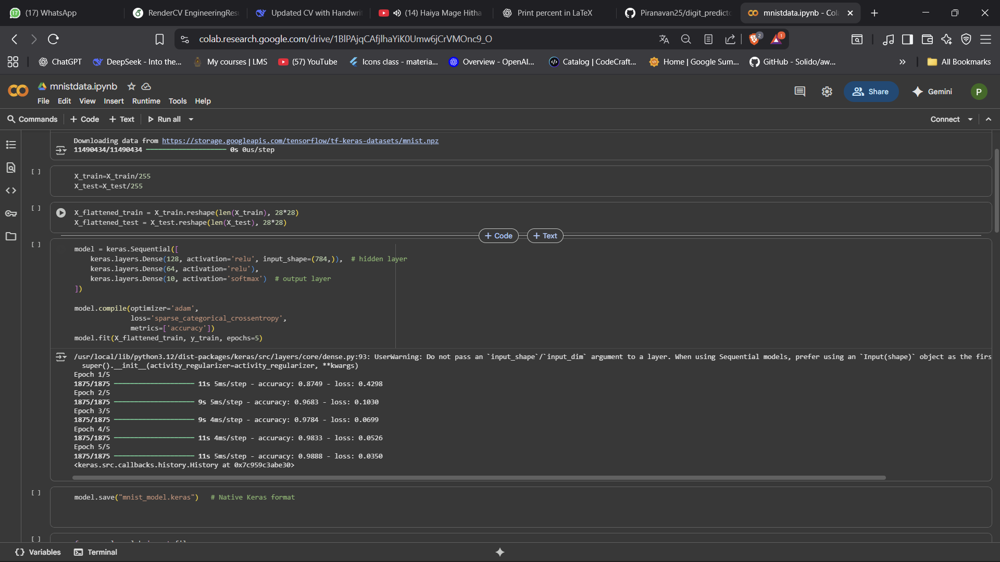
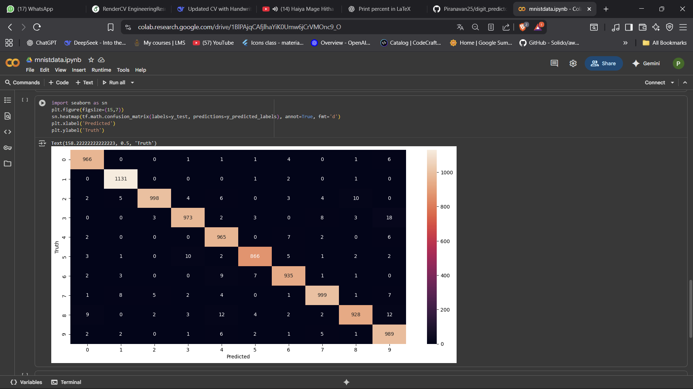
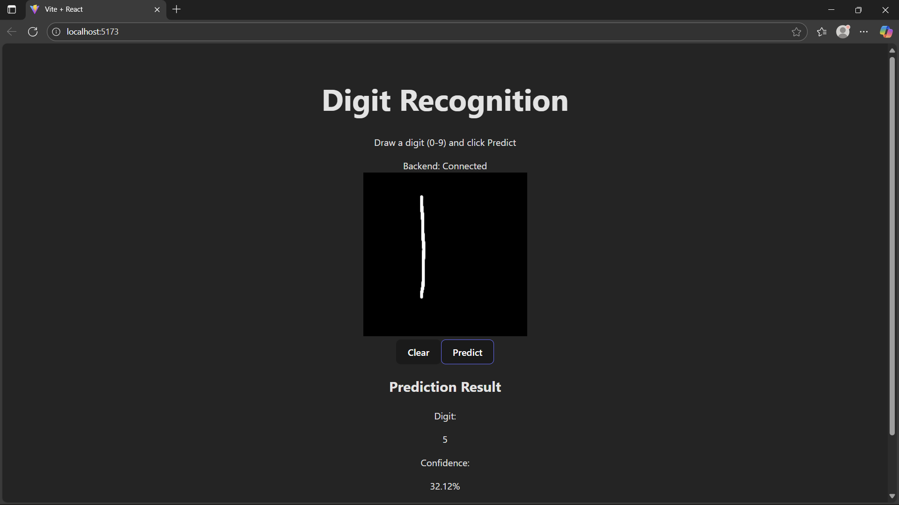
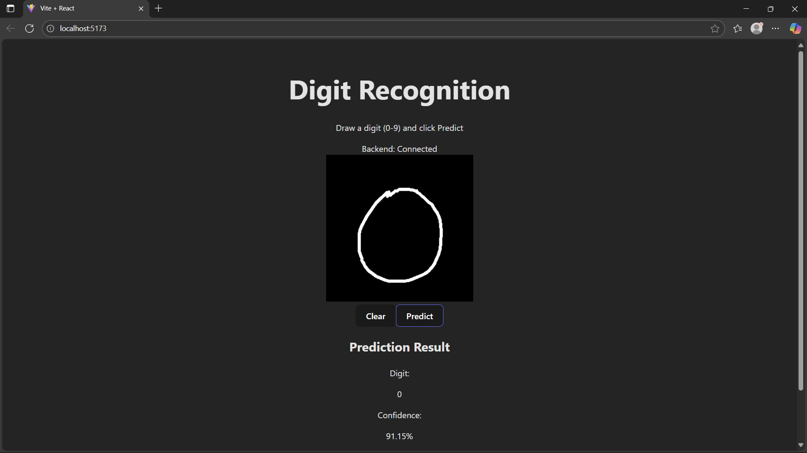
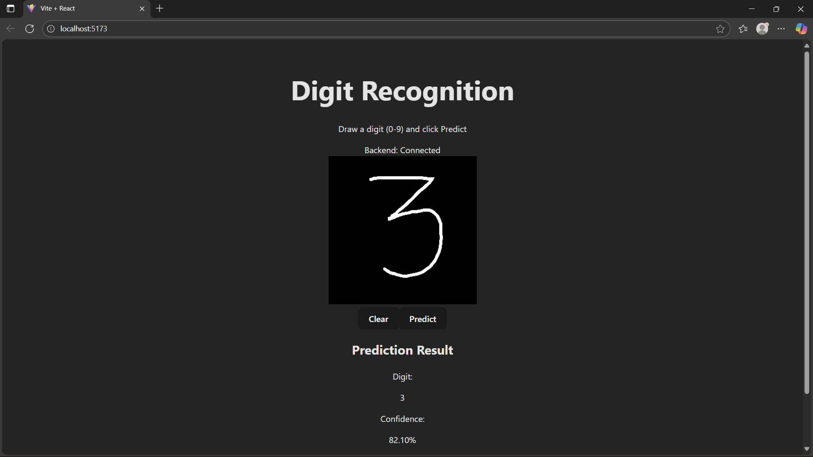
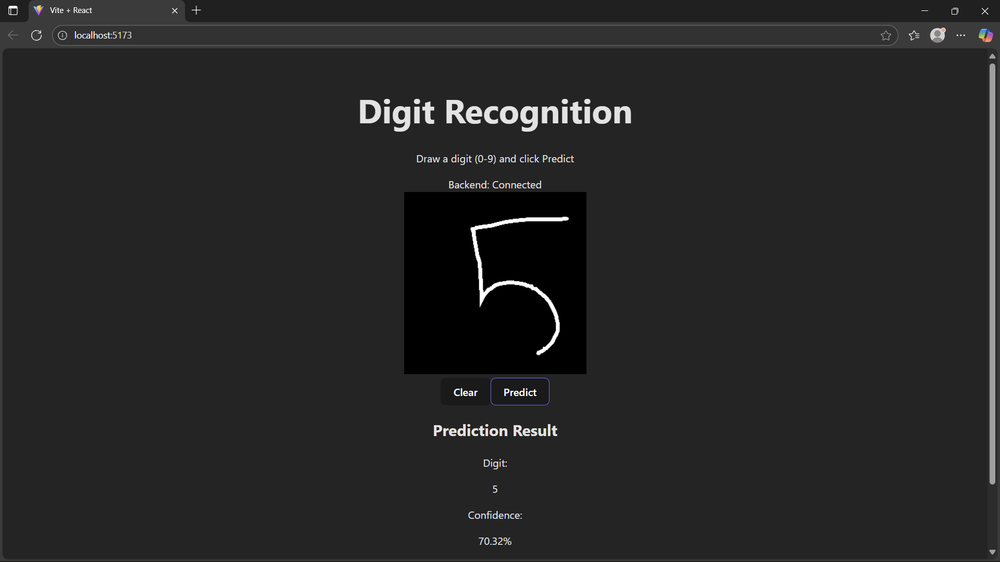

# Digit Predictor

A web application that predicts handwritten digits (0–9) using a deep learning model trained on the MNIST dataset.

## 🚀 Features

- ✍️ Draw digits on a canvas in the browser.
- 🤖 Backend powered by TensorFlow model trained on MNIST.
- 🔗 React frontend for user interaction.
- ⚡ Flask backend for serving predictions.
- 🎯 Real-time digit recognition with confidence scores.

## 🛠️ Tech Stack

- **Frontend**: React + Vite
- **Backend**: Flask (Python)
- **Model**: TensorFlow / Keras (trained on MNIST)
- **Other**: HTML5 Canvas for digit drawing

## ⚙️ Setup & Run

### 1. Clone the Repository
```bash
git clone https://github.com/Piranavan25/digit_predictor.git
cd digit_predictor
```

### 2. Backend (Flask + TensorFlow)
```bash
cd backend
pip install -r requirements.txt
python app.py
```

### 3. Frontend (React)
```bash
cd frontend
npm install
npm run dev
```

- Frontend will be available at 👉 http://localhost:5173
- Backend will be running at 👉 http://localhost:5000

## 📊 Demo


Example:










## 📖 Future Improvements

- ✅ Improve UI with better canvas tools.
- ✅ Train with more datasets for better accuracy.
- 🔲 Deploy online (Heroku / Vercel).
- 🔲 Add support for multi-digit recognition.


